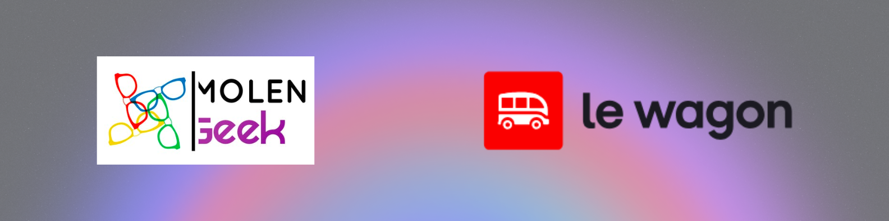
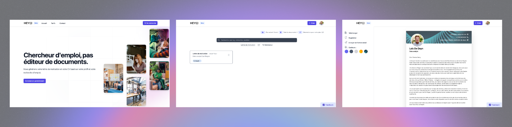
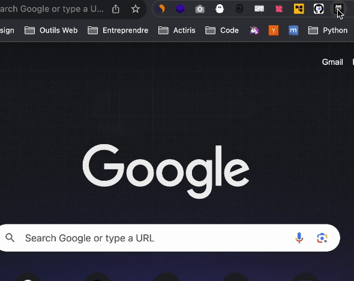

### Hello World From Belgium 🇧🇪! My name is Loïc 👋

**I'm a curious fullstack web developer. Passionate about programming, challenges and building awesome products.**

### Went From Zero To Hero with the help of :

### What I've built :

**Resume and cover letter generator :**

Features :
- AI content generation (OpenAI api & OpenAI gem)
- Resume and cover letter inline editing (Hotwire Turbo frames)
- PDF generation (Doppio.sh api)
- Dashboard (Search and tagging features)

Technologies :
- Ruby on Rails
- Google auth
- Stripe
- Hotwire
- Tailwind css
- Alpine JS

---

**[Github repositories tracker - Chrome extension](https://github.com/loddaa/Github-Collab-Repository)**

Features :
- Get access to all your Github repo even as a collaborator.

Technologies :
- Google Chrome extension api
- Github api
- Pure JS (no external packages)

### Feel free to contact me on [LinkedIn](https://www.linkedin.com/in/loic-de-deyn/)

