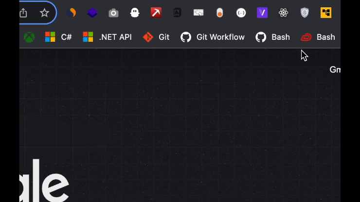

### Hello World From Belgium 🇧🇪! My name is Loïc 👋

**I am a curious fullstack web developer. Passionate about programming, challenges and building awesome products.**

### Went From Zero To Hero with the help of :

### What I have build :

**Resume and cover letter generator :**

Features :
- AI content generation (OpenAI api & OpenAI gem)
- Resume and cover letter inline editing (Hotwire Turbo frames)
- PDF generation (Doppio.sh api)
- Dashboard (Search and tagging features)

Technologies :
- Ruby on Rails
- Google auth
- Stripe
- Hotwire
- Tailwind css
- Alpine JS
- OpenAI

---

**[Github repositories tracker - Chrome extension](https://github.com/loddaa/github-repositories-tracker-Chrome-extension)**

Features :
- Add and remove Github repositories to collection

Technologies :
- Google chrome extension api
- Github api
- Pure JS (no external packages)

### Feel free to contact me on [LinkedIn](https://www.linkedin.com/in/loic-de-deyn/)

